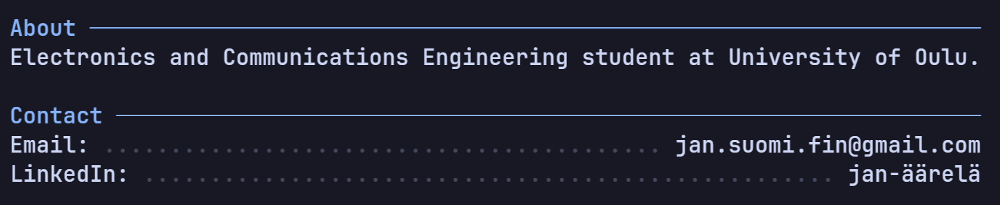

<!--  -->

<table border="0" id="table1">
  <tr>
    <td width="50%" valign="top" align="center">
        
<b>Electronics student @ University of Oulu.</b> 
        <i>Who dabbles with programming.</i>

        
⚡🎓🖥️

        
              
       
    </td>
    <td width="50%" valign="top">
      
    </td>
  </tr>
</table>

  
    <b>Electronics student @ University of Oulu.</b> 
    <i>Who dabbles with programming.</i>  
    ⚡🎓🖥️  
    
    
  

  
    
  

